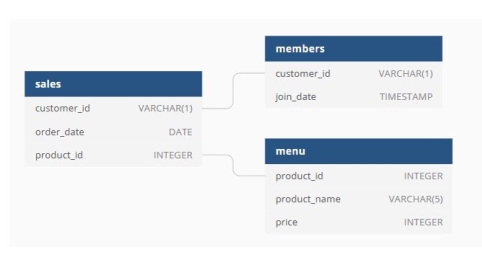

# Proyecto Data Engineering con Spark

---

**Caso:**

La pizzeria Danny quiere usar los datos para responder algunas preguntas simples sobre sus
clientes, especialmente sobre sus patrones de visitas, cuánto dinero han gastado y también qué
elementos del menú son sus favoritos.

---

**Diagrama:**

---
**Preguntas:**

Resolver las siguientes preguntas usando Apache Spark.
- ¿Cuál es la cantidad total que gastó cada cliente en el restaurante?
- ¿Cuántos días ha visitado cada cliente el restaurante?
- ¿Cuál fue el primer artículo del menú comprado por cada cliente?
- ¿Cuál es el artículo más comprado en el menú y cuántas veces lo compraron todos los clientes?
- ¿Qué artículo fue el más popular para cada cliente?
- ¿Qué artículo compró primero el cliente después de convertirse en miembro?
- ¿Qué artículo se compró justo antes de que el cliente se convirtiera en miembro?
- ¿Cuál es el total de artículos y la cantidad gastada por cada miembro antes de convertirse en miembro?
- Si cada $ 1 gastado equivale a 10 puntos y el sushi tiene un multiplicador de puntos 2x, ¿cuántos puntos tendría cada cliente?
- En la primera semana después de que un cliente se une al programa (incluida la fecha de ingreso), gana el doble de puntos en todos los artículos, no solo en sushi. ¿Cuántos puntos tienen los clientes A y B a fines de enero?

---

**Datos:**

Puedes encontrar los archivos [aqui](https://github.com/datahackformation/DEP7_Apache-Spark/tree/main/Trabajo%20Final/Data)

**Entregables:**

- Incluir todos los puntos solicitados en un artículo de Medium o plataforma similar.
- Publicar el código en un repositorio de GitLab o Github.
- Video resumen de máximo 20 minutos mostrando el código que responde a cada pregunta.